<div align="center">

# 🌾 HarvestHub

### Adaptive Product Scraping Platform

**Extract product data from any e-commerce site. Export to XLSX, CSV, JSON, or Google Merchant Center feeds.**

[](#testing)
[](https://github.com/SufficientDaikon/harvesthub/actions/workflows/ci.yml)
[](https://codecov.io/gh/SufficientDaikon/harvesthub)
[](https://www.npmjs.com/package/harvest-hub)
[](#tech-stack)
[](#tech-stack)
[](#api-endpoints)
[](#license)
[](#)

[](https://vercel.com/new/clone?repository-url=https://github.com/SufficientDaikon/harvesthub)

[**Getting Started**](#quick-start) · [**Features**](#features) · [**Dashboard**](#dashboard) · [**CLI Reference**](#cli-commands) · [**API Docs**](#api-endpoints) · [**Architecture**](#architecture)

</div>

<p align="center"></p>

---

## What is HarvestHub?

HarvestHub is a **TypeScript-first web scraping platform** that uses Python's [Scrapling](https://scrapling.readthedocs.io/) library for adaptive, anti-bot product data extraction. It intelligently extracts product information from **any e-commerce site** using a 3-tier strategy with confidence scoring.

**Who is this for?**

- 🛒 **E-commerce professionals** monitoring competitor pricing
- 📊 **Data analysts** building product datasets
- 🔄 **Developers** automating product data pipelines
- 📈 **Marketers** generating Google Merchant Center feeds

**Why HarvestHub?**

- Works on **any** e-commerce site — no site-specific templates needed
- **Confidence scoring** tells you how reliable each data point is
- **Premium exports** — not just data dumps, but styled XLSX with summary sheets
- **Zero cost** — no paid APIs, proxies, or services required
- **140 tests passing** — production-grade reliability

---

## Quick Start

```bash
# 1. Clone & install
git clone https://github.com/SufficientDaikon/harvesthub.git
cd harvesthub
npm install
pip install -r engine/requirements.txt

# 2. Verify everything works
npx tsx src/cli/index.ts status

# 3. Scrape some products
npx tsx src/cli/index.ts scrape --input "https://books.toscrape.com/catalogue/a-light-in-the-attic_1000/index.html"

# 4. Export your data
npx tsx src/cli/index.ts export -f xlsx -o products.xlsx

# 5. Launch the dashboard
npx tsx src/cli/index.ts dashboard -p 4000
# Open http://localhost:4000
```

Or use the one-command bootstrap on Windows:

```powershell
.\setup.ps1
```

---

## Features

### 🎯 Adaptive 3-Tier Extraction

HarvestHub doesn't rely on brittle CSS selectors. It uses an intelligent extraction pipeline:

| Tier | Method                                                                   | Confidence        | Speed    |
| ---- | ------------------------------------------------------------------------ | ----------------- | -------- |
| 1️⃣   | **JSON-LD** — Structured data from `<script type="application/ld+json">` | Highest (90-100%) | Fastest  |
| 2️⃣   | **Microdata** — Schema.org attributes (`itemprop`, `itemtype`)           | High (70-90%)     | Fast     |
| 3️⃣   | **CSS Heuristics** — Intelligent DOM analysis with scoring               | Medium (40-70%)   | Moderate |

Each extracted field gets an individual confidence score so you know exactly how reliable your data is.

### 📦 Premium Export Formats

| Format   | Description                                                                          |
| -------- | ------------------------------------------------------------------------------------ |
| **XLSX** | Dark-themed headers, conditional formatting, hyperlinks, summary sheet, auto-filters |
| **CSV**  | UTF-8 with BOM for Excel compatibility                                               |
| **JSON** | Structured export with metadata header                                               |
| **GMC**  | Google Merchant Center compliant TSV feed with field validation                      |

### 🖥️ Real-Time Dashboard

A premium SaaS-style web dashboard with:

- 🔍 Full-text search across products
- 📊 Charts and aggregated statistics
- 🌓 Dark/light theme toggle
- 📅 Schedule management UI
- 📈 Price change history and trends
- 💾 One-click export downloads
- 🔌 WebSocket live updates during scrapes

### ⏰ Cron Scheduling

Schedule recurring scrapes with standard cron expressions:

```bash
# Scrape every day at 9 AM
npx tsx src/cli/index.ts schedule add --name "Daily scrape" --cron "0 9 * * *" --urls products.txt

# List all schedules
npx tsx src/cli/index.ts schedule list

# Start the scheduler (runs in foreground)
npx tsx src/cli/index.ts schedule start
```

### 📉 Price Change Tracking

When products are re-scraped, HarvestHub automatically:

- Detects price changes with delta and percentage calculations
- Maintains full price history per product
- Provides trend indicators (up/down/stable)
- Exposes history via API: `GET /api/products/:id/history`

### 🛡️ Resilient Scraping Engine

- **Rate Limiting** — Per-domain token bucket prevents blocking
- **Retry Engine** — Exponential backoff with jitter, error classification (transient/permanent/blocked)
- **User Agent Rotation** — 20 real browser user agents, round-robin
- **Proxy Rotation** — Optional proxy pool with file or env-var configuration
- **Stealth Mode** — Scrapling's StealthyFetcher for protected sites

---

## CLI Commands

```
harvest status                          Show system health & store stats
harvest scrape --urls file.txt          Scrape from URL file
harvest scrape --input url1,url2        Scrape specific URLs
harvest scrape --stealth                Use stealth mode for protected sites
harvest scrape --dry-run                Validate URLs without scraping
harvest scrape --proxies proxies.txt    Use proxy rotation
harvest export -f xlsx -o report.xlsx   Export to premium Excel
harvest export -f csv -o data.csv       Export to CSV
harvest export -f json -o data.json     Export to JSON
harvest export -f gmc -o feed.tsv       Export Google Merchant Center feed
harvest migrate                         Import legacy export_all.py data
harvest dashboard -p 4000              Start web dashboard
harvest schedule list                   List all schedules
harvest schedule add --name "..." ...   Create a new schedule
harvest schedule remove <id>            Delete a schedule
harvest schedule enable <id>            Enable a schedule
harvest schedule disable <id>           Disable a schedule
harvest schedule start                  Start all enabled schedules
```

### Scrape Options

| Flag                | Default                      | Description                          |
| ------------------- | ---------------------------- | ------------------------------------ |
| `--urls <file>`     | —                            | Path to URL file (one per line)      |
| `--input <urls>`    | —                            | Comma-separated URLs                 |
| `--output <path>`   | `data/exports/products.xlsx` | Output file path                     |
| `--format <fmt>`    | `xlsx`                       | Export format (xlsx, csv, json, gmc) |
| `--retries <n>`     | `3`                          | Max retries per URL                  |
| `--concurrency <n>` | `3`                          | Concurrent domain limit              |
| `--timeout <ms>`    | `30000`                      | Request timeout                      |
| `--stealth`         | `false`                      | Bypass bot protection (slower)       |
| `--no-export`       | —                            | Scrape and store only                |
| `--dry-run`         | —                            | Validate URLs without scraping       |
| `--proxies <file>`  | —                            | Proxy list file                      |

### URL File Format

```text
# Lines starting with # are ignored
# One URL per line, blank lines are skipped
https://example.com/product/widget-pro
https://store.example.com/items/gadget-x
https://shop.example.org/p/thingamajig
```

---

## Dashboard

Launch with `npx tsx src/cli/index.ts dashboard -p 4000` and open **http://localhost:4000**

| Page          | URL                 | Description                        |
| ------------- | ------------------- | ---------------------------------- |
| Dashboard     | `/` or `/dashboard` | Product explorer, stats, charts    |
| Documentation | `/docs`             | Full documentation & API reference |
| Marketing     | `/marketing`        | Product landing page               |

---

## API Endpoints

All endpoints available at `http://localhost:4000` when the dashboard is running.

| Method   | Endpoint                    | Description                                  |
| -------- | --------------------------- | -------------------------------------------- |
| `GET`    | `/api/status`               | System health, engine status, product count  |
| `GET`    | `/api/products`             | Paginated products with search/filter        |
| `GET`    | `/api/products/:id/history` | Price history for a product                  |
| `GET`    | `/api/stats`                | Aggregated statistics, top brands/categories |
| `GET`    | `/api/export/:format`       | Download export file                         |
| `GET`    | `/api/jobs`                 | Last 20 scrape jobs                          |
| `GET`    | `/api/schedules`            | List all schedules                           |
| `POST`   | `/api/schedules`            | Create a schedule                            |
| `PATCH`  | `/api/schedules/:id`        | Update a schedule                            |
| `DELETE` | `/api/schedules/:id`        | Delete a schedule                            |
| `WS`     | `/ws`                       | WebSocket for real-time scrape events        |

### Query Parameters for `/api/products`

| Param          | Type   | Description                            |
| -------------- | ------ | -------------------------------------- |
| `page`         | number | Page number (default: 1)               |
| `limit`        | number | Items per page (default: 50, max: 200) |
| `search`       | string | Search title, description, SKU         |
| `brand`        | string | Filter by brand                        |
| `availability` | string | Filter by availability status          |

---

## Architecture

```
┌──────────────────────────────────────────────────────────────┐
│                      TypeScript Layer                         │
│                                                              │
│  CLI ──→ URL Parser ──→ Rate Limiter ──→ Retry Engine       │
│                                              │               │
│                                         Scrape Bridge        │
│                                         (JSON IPC)           │
│                                              │               │
│  Dashboard ←── API Server ←── Store ←── Normalizer           │
│  (Express)     (REST+WS)     (JSON)    (prices,              │
│                                         currency)            │
│                                              │               │
│  Exporters: XLSX │ CSV │ JSON │ GMC          │               │
│  Scheduler: Cron jobs (croner)               │               │
│  Price Differ: Change detection              │               │
└──────────────────────────────────────────────┼───────────────┘
                                               │
                              ┌─────────────────▼──────────────┐
                              │        Python Engine           │
                              │        (Scrapling)             │
                              │                                │
                              │  Tier 1: JSON-LD extraction    │
                              │  Tier 2: Microdata extraction  │
                              │  Tier 3: CSS heuristics        │
                              │                                │
                              │  Confidence scoring per field  │
                              └────────────────────────────────┘
```

---

## Project Structure

```
harvesthub/
├── engine/
│   ├── scraper.py              # Python Scrapling engine (380 lines)
│   └── requirements.txt        # Python dependencies
├── src/
│   ├── types/                  # TypeScript interfaces (Product, Job, Schedule)
│   ├── lib/                    # Errors, logger, URL parser/validator
│   ├── core/                   # Scrape bridge, rate limiter, retry engine,
│   │                           # UA pool, proxy pool, scheduler, WS broadcast,
│   │                           # price differ, job runner
│   ├── pipeline/               # Data normalization
│   ├── store/                  # JSON file persistence (atomic writes)
│   ├── export/                 # XLSX, CSV, JSON, GMC exporters
│   ├── api/                    # Express server + Vercel handler
│   ├── cli/                    # Commander.js CLI (6 commands)
│   └── __tests__/              # 14 test files, 140 tests
├── dashboard/
│   ├── index.html              # SaaS dashboard
│   ├── docs.html               # Documentation page
│   └── marketing.html          # Landing page
├── api/
│   └── index.ts                # Vercel serverless entry
├── data/
│   ├── store/                  # Product database
│   ├── exports/                # Generated files
│   └── logs/                   # Application logs
├── package.json
├── tsconfig.json
├── vercel.json                 # Vercel deployment config
└── setup.ps1                   # One-command bootstrap
```

---

## Tech Stack

| Technology             | Role                                |
| ---------------------- | ----------------------------------- |
| **TypeScript**         | Core application (strict mode)      |
| **Python + Scrapling** | HTTP fetching + HTML parsing engine |
| **Node.js**            | Runtime                             |
| **Express**            | API server + static file serving    |
| **ExcelJS**            | Premium XLSX export                 |
| **Commander.js**       | CLI framework                       |
| **Croner**             | Cron job scheduling                 |
| **WebSocket (ws)**     | Real-time scrape event broadcasting |
| **Pino**               | Structured JSON logging             |
| **Zod**                | Runtime type validation             |
| **Vitest**             | Testing framework                   |
| **Nanoid**             | Unique ID generation                |

---

## Testing

```bash
# Run all 140 tests
npx vitest run

# Run with coverage report
npm run test:coverage

# Run with watch mode
npx vitest

# Type check
npx tsc --noEmit
```

**Test coverage:**

- Unit tests: errors, normalizer, URL parser/validator, UA pool, proxy pool, rate limiter, retry engine, price differ, WS broadcast, store, scheduler
- Integration tests: API endpoints (products, stats, jobs, schedules, export, price history), export pipeline (all 4 formats)

---

## Deployment

### Local

```bash
npx tsx src/cli/index.ts dashboard -p 4000
```

### Vercel

One-click deploy — the dashboard runs in read-only mode on Vercel (scraping endpoints return 503 since the Python engine isn't available in serverless).

[](https://vercel.com/new/clone?repository-url=https://github.com/SufficientDaikon/harvesthub)

Or deploy manually:

```bash
npm i -g vercel
vercel deploy
```

**How it works:**
- `api/index.ts` — Vercel serverless adapter wrapping the Express app
- `dashboard/` — Served as static files
- Scraping endpoints (`POST /api/batch`) return `503 Scraping unavailable in serverless mode`
- All read-only endpoints (products, stats, exports) work normally

### Docker

Run the entire platform in a container — no Node.js or Python installation required.

```bash
# Build and start with Docker Compose
docker compose up --build

# Or build and run standalone
docker build -t harvesthub .
docker run -p 4000:4000 -v ./data:/app/data harvesthub
```

The `./data` directory is mounted as a volume so scraped products persist across container restarts.

**Environment variables:**
| Variable | Default | Description |
|----------|---------|-------------|
| `NODE_ENV` | `production` | Node environment |
| `PORT` | `4000` | API server port |

---

## npm Package

Install HarvestHub globally for CLI access:

```bash
npm install -g harvest-hub
```

Then use anywhere:

```bash
harvest scrape --input "https://example.com/product"
harvest export -f xlsx -o products.xlsx
harvest dashboard -p 4000
```

### Use as a Library

```typescript
import { createServer, loadProducts } from 'harvest-hub';
import type { Product, ScrapeJob } from 'harvest-hub';

// Start the API server programmatically
const app = createServer(4000);

// Load stored products
const products: Product[] = await loadProducts();
```

### Publishing

```bash
npm login
npm publish
```

The `prepublishOnly` script ensures `npm run build && npm test` passes before every publish.

---

## Chrome Extension

The `extension/` directory contains a Manifest V3 Chrome extension for one-click product data extraction.

### Installation

1. Open Chrome and navigate to `chrome://extensions/`
2. Enable **Developer mode** (toggle in the top right)
3. Click **Load unpacked**
4. Select the `extension/` directory from this repo

### Usage

1. Navigate to any product page
2. Click the HarvestHub extension icon
3. Click **🌾 Scrape This Page**
4. View extracted product data (title, price, availability, confidence)
5. Click **💾 Save to HarvestHub** to persist

### Configuration

Click **⚙️ Settings** in the popup to configure:
- **API Endpoint** — point to your HarvestHub server (default: `http://localhost:4000`)

---

## Requirements

- **Node.js** ≥ 18
- **Python** ≥ 3.9
- **pip packages**: `scrapling`, `orjson`, `browserforge`

---

## Extracted Data Fields

HarvestHub extracts 16+ fields per product, each with individual confidence scores:

| Field            | Type     | Description                                |
| ---------------- | -------- | ------------------------------------------ |
| `title`          | string   | Product title                              |
| `price`          | number   | Current price                              |
| `currency`       | string   | ISO currency code                          |
| `description`    | string   | Product description                        |
| `images`         | string[] | Image URLs                                 |
| `availability`   | enum     | in_stock, out_of_stock, pre_order, unknown |
| `brand`          | string   | Brand name                                 |
| `sku`            | string   | Stock keeping unit                         |
| `mpn`            | string   | Manufacturer part number                   |
| `gtin`           | string   | Global trade item number                   |
| `category`       | string   | Product category                           |
| `rating`         | number   | Average rating                             |
| `reviewCount`    | number   | Number of reviews                          |
| `specifications` | object   | Key-value specifications                   |
| `seller`         | string   | Seller name                                |
| `shipping`       | string   | Shipping info                              |

---

## Contributing

We welcome contributions! Please see our [Contributing Guide](CONTRIBUTING.md) for details on:

- Setting up your development environment
- Code style and conventions
- Testing guidelines
- Pull request process

---

## License

MIT — use it however you want.

---

<div align="center">

**Built with 🌾 by [HarvestHub](https://github.com/SufficientDaikon/harvesthub)**

</div>
